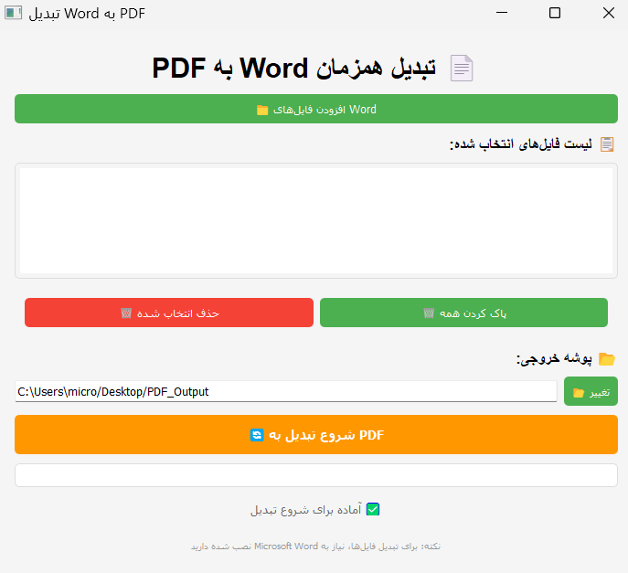

# 📄 Batch Word to PDF Converter

[](https://python.org)
[](LICENSE)
[]()

> **تبدیل همزمان چندین فایل Word به PDF با رابط گرافیکی ساده و حرفه‌ای**  
> *Batch convert multiple Word files to PDF with a simple and professional GUI*

---

## ✨ ویژگی‌ها / Features

### فارسی:
- ✅ **تبدیل همزمان** چندین فایل Word به PDF
- 🎨 **رابط گرافیکی** کاربرپسند و زیبا
- 📁 **انتخاب پوشه خروجی** دلخواه
- 📊 **نوار پیشرفت** نمایش وضعیت تبدیل
- 🗑 **مدیریت فایل‌ها** (حذف تکی/گروهی)
- 🔄 **اجرا در ترد جداگانه** (عدم هنگ کردن برنامه)
- 🛡 **مدیریت خطاها** و نمایش پیام‌های واضح
- 📦 **محیط مجاز (venv)** برای ایزوله کردن کتابخانه‌ها

### English:
- ✅ **Batch conversion** of multiple Word files to PDF
- 🎨 **User-friendly GUI** with modern design
- 📁 **Custom output folder** selection
- 📊 **Progress bar** showing conversion status
- 🗑 **File management** (single/group removal)
- 🔄 **Separate thread execution** (prevents freezing)
- 🛡 **Error handling** with clear messages
- 📦 **Virtual environment (venv)** for isolated dependencies

---

## 📸 پیش‌نمایش / Screenshot

---

## 📋 پیش‌نیازها / Prerequisites
---
### ویندوز / Windows:
- **Windows 7, 8, 10, or 11**
- **Microsoft Word** (2010 or later) - Required for conversion
- **Python 3.7 or higher**
- **Internet connection** (for first-time setup)
---
---
### لینوکس / Linux:
- **Ubuntu 18.04+, Debian 10+, Fedora 32+, or similar**
- **Microsoft Word** (via Wine) OR **LibreOffice** (alternative method)
- **Python 3.7 or higher**
- **Internet connection** (for first-time setup)

> **Important Note**: The converter uses Microsoft Word's conversion engine. On Linux, you need Word installed via Wine, or we can provide a LibreOffice alternative.

---

## 🚀 نصب و راه‌اندازی / Installation Guide

### مرحله 1: نصب پایتون / Step 1: Install Python

#### ویندوز /  linux / Windows:
```bash
# Download Python from python.org
# Or install via Chocolatey:
choco install python

# Verify installation:
python --version


####  / Linux:
# Update package list:
sudo apt update

# Install Python and pip:
sudo apt install python3 python3-pip python3-venv -y

# Verify installation:
python3 --version
pip3 --version
# Create virtual environment:
python3 -m venv venv

# Activate virtual environment:
source venv/bin/activate

# You should see (venv) in your terminal prompt

# Clone the repository or download the files
git clone https://github.com/Arian-Azar/WordToPDF-Converter.git
# OR download and extract the ZIP file

# Navigate to project directory:
cd word-to-pdf-converter


#### ویندوز / Windows:
# Create virtual environment:
python -m venv venv

# Activate virtual environment:
venv\Scripts\activate

# You should see (venv) in your terminal prompt


# Make sure virtual environment is activated
pip install -r requirements.txt

# Or install manually:
pip install PyQt5 docx2pdf

# Verify installation:
pip list


# Make sure virtual environment is activated
python DocxToPDF.py

# OR
python3 DocxToPDF.py
